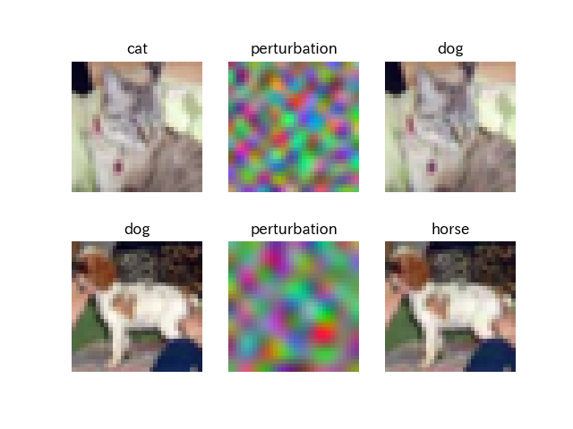
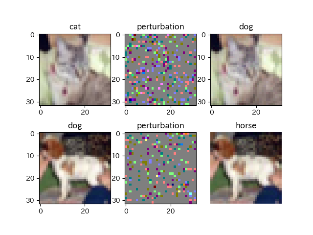
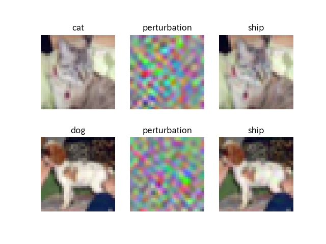

# SimBA-Keras

This repository contains demo code for [SimBA (Simple Black-box Adversarial Attacks)](https://arxiv.org/abs/1905.07121) implemented in Keras.

Demo uses the VGG-20 model for the CIFAR-10 dataset obtained from a GitHub repository [GuanqiaoDing/CNN-CIFAR10](https://github.com/GuanqiaoDing/CNN-CIFAR10)

## Usage
### Install SimBA
```
pip install git+https://github.com/kztakemoto/adversarial-robustness-toolbox
```
Code for SimBA is [here](https://github.com/kztakemoto/adversarial-robustness-toolbox/blob/master/art/attacks/evasion/simba.py). [nquntan](https://github.com/nquntan) and kztakemoto implemented SimBA using [Adversarial Robustness 360 Toolbox](https://arxiv.org/abs/1807.01069) (ART) v1.1.

### Non-targeted Attacks
```
python run_demo_simba_single.py
```
Attacks using discrete cosine transform (DCT) basis vectors are used in default.



Note: Perturbation is emphatically displayed for clarity.

Random pixel attaks are also available.
```
python run_demo_simba_single.py --attack px
```


### Targeted Attacks
```
python run_demo_simba_single.py --targeted
```
Demo code considers targeted attacks to "ship".

